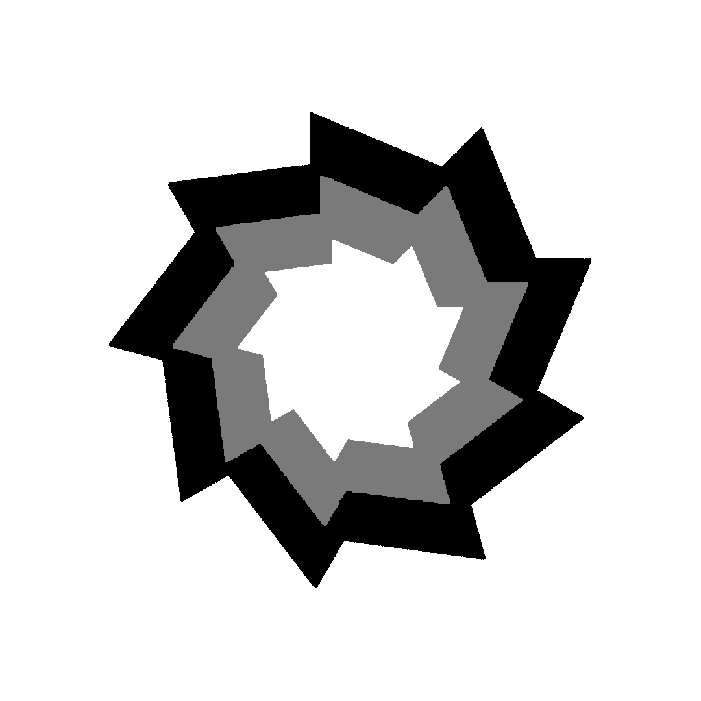

Starting Date: April 28, 2026. \
Days are just days-since-started, so there may be a large void in days at some parts (like Day 4 - Day 7).

# Day 1 - Tuesday | In class work #
No functionality added yet, I started this midway through class so the goal for today has just been to set up the HTML and JS files.

### Things Added:
 - Fundamental code and files to make the website run  

<br>

# Day 2 - Wednesday | In class work #
Got the full-screen canvas fully set up. For now, the player's design is just a basic circle, I plan to replace it with something else later. \
The movement has also been added, the "A", "D" and left/right arrow-keys can be used to move the player left & right, while the "W" key & up arrow-key inverts the direction of gravity. I have an idea for what the "S" key & down arrow-key should do, but it requires features that don't exist yet to be useful and I dont feel like programming it right now.

### Things Added:
 - Canvas
 - Player movement

<br>

# Day 3 - Thursday | In class work #
Gavin Diep helped me create a nice design for the player, it's inspired mostly by Geometry Dash's design for the default ball skin. \
I refined some aspects of the game, such acceleration due to gravity and making the player spin when it moves left and right. 



### Things Added:
 - Player movement refinement
 - Player Design

<br>

# Day 4 - Friday | In class work #
I started working on the mechanics for the portal, which marks the checkpoint for the end of a level and warps the player into a new level. Gavin created a design for it. The portals functionality is still very incomplete, right now I'm just working on a 'gravitational pull' effect to suck the player into the portal when they get close enough.

### Things Added:
 - Portal Design

<br>

# Day 7 - Monday | In class work #
I continued working on the gravity for the portal, it was initially very rigid and jarring, so I smoothened it out. This was done by finding the angle from the player to the portal, getting the difference in that angle and the angle the player is currently facing, gradually incrementing the players angle by small portions of that difference, then finally incrementing the players coordinates based off that angle. The following code is a summarized rundown of my solution:
``` javascript
// get the difference in the coordinates of the portal and player
const portalDx = portal.x - player.x;
const portalDy = portal.y - player.y;

// get angle from the player to the portal
const angleToPortal = Math.atan2(portalDy, portalDx);

// get the difference of the angleToPortal and the angle the player is currently facing
let dAngle = angleToPortal - player.facingAngle;
dAngle = Math.atan2(Math.sin(dAngle), Math.cos(dAngle)); // normalize it

// get a turn speed proportional to the distance from the player to the portal
const turnSpeed = 0.1;

// add either the dAngle or the turnSpeed to the players angle
player.facingAngle += Math.sign(dAngle) * Math.min(Math.abs(dAngle), turnSpeed);

// increment the players coordinates
player.x += Math.cos(player.facingAngle);
player.y += Math.sin(player.facingAngle);
```

### Things Added:
 - Portal Gravity

<br>

# Day 8 - Tuesday | In class work #
I mostly worked on implementing levels and obstacles (both of which use classes), but took a slight detour to give the game a title screen. The play button for the title screen required me to add a `mousemove` and `click` event listener to the document to check for hover and click inputs. Nothing was fully completed this class.

### Things Worked On:
 - `Level` class and `Block` class
 - Title Screen

<br>

# Day 9 - Wednesday | In class work #
Gavin created a lot of new designs for the game, such as a background, a grassy floor, and a cloudy roof. I completed the title screen's layout and got the play button working. I had issues detecting the cursors coordinates accurately for a while, then I eventually found out that the problems stems from how the coordinates on the canvas differ from that of the clients screen, so to make them accurate, I needed to scale the cursors coordinates to match the canvas:
```javascript
function mouseMoveHandler(e) {
    const rect = cnv.getBoundingClientRect();
    
    // scale
    const scaleX = cnv.width / rect.width;
    const scaleY = cnv.height / rect.height;
    
    // save the coordinates in global variables
    mouseX = (e.clientX - rect.left) * scaleX;
    mouseY = (e.clientY - rect.top) * scaleX * 1.05; // notice this bug here? it took me a week to find out about it.
}
```

### Things Added:
 - Custom Background & Floor/Roof Design
 - Title Screen & Play Button

<br>

# Day 10 - Thursday | In class work #
I've done a lot of work on the blueprint and foundation for levels and I've decided that I'll code all the levels/obstacles themselves inside a function called `setUpLevels`. Right now the function has set up 10 `Level` objects. From tommorrow and onward, I'll be designing the layout for each level. I plan to make level one void of obstacles and have a very simple guide on the games controls.

### Things Added:
 - Levels (no obstacles yet)

<br>

# Day 11 - Friday | In class work & At home work #
I've been struggling to get the player collisions with obstacles working properly, specifically, the collisions that happens when the player comes into contact with either the left or right side of a block. These collisions cause the player to teleport to the top of the block instead of restricting the player's x coordinate. I'm aware that this is due to how collision conditionals overlap one another.
``` javascript
const fallingUpIntoBlock = (
    player.y + player.r > this.y + this.h*0.5 && player.y - player.r + gravity < this.y + this.h &&
    player.x + player.r + player.speed > this.x && player.x - player.r - player.speed < this.x + this.w
);
// vs
const movingRightIntoBlock = (
    player.x + player.r + player.speed > this.x && player.x - player.r < this.x + this.w && // extremely similar conditions to the above constant
    player.y + player.r > this.y && player.y - player.r < this.y + this.h
);
```
<br>

### At Home Work
It took a while, but I found a solution to the collisions issue. I counteracted the overlapping values by expanding the range required for a sideways collisions to be detected.

```javascript
const movingRightIntoBlock = (
    player.x + player.r > this.x - player.speed*0.1 && player.x - player.r < this.x + this.w*0.25 &&
    player.y + player.r > this.y && player.y - player.r < this.y + this.h
);
```
Due to the `this.x - player.speed*0.1` the player doesn't need to directly go past the block's x coordinate for a collision to be detected. In comparison to the collisions for falling up and down into the block, this creates some leeway.

### Things Added:
 - Obstacle Collisions

<br>

# Day 13 - Sunday | At home work #
I wanted to add a bit of a tutorial to the game for explaining the controls so I created a text class. I realized that there were some similarities between the `Text` and `Block` classes, as well as the obstacles I plan to add, so I made an `Obstacle` class with properties and methods that every type of obstacle in the game should have. It's only a template so the class itself won't ever be used, just inherited.
Level one and two are pretty much complete, they don't have much content at all, but thats intentional because they only exist to explain the controls.

### Things Added:
- `Obstacle` Class, `Text` Class, and Inheritance
- Level 1 and 2 + tutorial text

<br>

# Day 14 - Monday | In class work #
While working on level 3, I noticed that there were still many issues with the collisions for blocks, so I spent a lot of time on improving the `checkCollisions()` method for the `Block` class. Gavin helped me design a gradient play button for the game as well.

### Things Worked On:
 - Improved block collision detection
 - Some of level 3
 - Title screen

<br>

# Day 15 - Tuesday | In class work & At home work #
I completed level 3 and updated the `Block` and `Text` class's by giving them a rotation property, allowing me to freely rotate them with a single arguement. Only issue is that it doesn't rotate their hitboxes.
<br>

### At Home Work
I began working on a `Spike` class and created a `respawnPlayer()` function.

### Things Added:
 - All of level 3 and small bits of level 4
 - Furthur improved on block collisions
 - rotation property for obstacle-related classes
 - Started developing spikes and created a `respawnPlayer()` function

<br>

# Day 16 - Wednesday | In class work #
I finished creating the `Spike` class while working on level 4. Player death and respawning has also been fully accounted for.

### Things Added:
 - All of level 4
 - Completed the `Spike` class

<br>

# Day 17 - Thursday | In class work #
I spent the entire class designing level 5 and I didn't encounter any issues/bugs while making it. I plan for level 6 and above to have a cave-like aesthetic, mainly because Gavin designed a backdrop for cave levels and I thought it looked cool.

### Things Added:
 - All of level 5

<br>

# Day 18 - Friday | In class work #
I started working on the players second ability. By pressing `S` or the down arrow-key, the player can phase through certain blocks. To get working, this ability only reqiured a new `phasing` property for the player object along with two very short methods. I updated the `Block` class to accept `"phase"` as an argument for its `variant` property, this lets me identify which blocks can and cannot be phased through. Phase blocks will only be used in the cave-type levels.

### Things Added:
 - Phasing ability and phase-variant blocks

<br>

# Day 22 - Tuesday | In class work #
I was hoping to finish all of level 6 today, but I got sidetracked by the idea of "phaseable spikes". These type of spikes weren't necessarily challenging to code, but thinking of unique ways to use them took up a lot of my time, so I didn't complete all of level 6, but about 90% of it is done. Gavin also worked on a cave-like design for the blocks in cave levels and I did a lot of recoloring of other parts of the level to make everything look good.

### Things Added:
 - Most of level 6 and phase-variant spikes
 - Cave designs for blocks

<br>

# Day 23 - Wednesday | In class work & At home work #
I completed the rest of level 6. It only needed minor design improvements. \
While working on level 7, I was once again forced to pay attention to the collision flaws of the blocks hitboxes. Due to how I set up the conditions for blocks, the hitboxes of every block would scale with their size, for example:
``` javascript
// checks if the player is moving right and hitting the block
const movingRightIntoBlock = (
    player.x + player.r > this.x - player.speed*0.4 && player.x + player.r < this.x + this.w*0.1 && // `+ this.w*0.1` scales with the block's width
    player.y + player.r > this.y && player.y - player.r < this.y + this.h

if (movingRightIntoBlock) player.x = this.x - player.r - player.speed*0.41;
);
```
The section `player.x + player.r < this.x + this.w*0.1` may initially seem harmless. It simply checks if the players x coordinate is slightly inside the block's x coordinate by checking the first 10% of the block's width, then if the if-statement is true, the player's x coordinate is pushed to the left of the block. What I willingly overlooked was that when a block is scaled up to widths of over 200, the `movingRightIntoBlock` condition can return true if the player touches a point on top of the block thats seemingly far past it's x-coordinate. I was already noticing this issue earlier in the project, but I chose to ignore it because it had minor impacts with the small blocks I was using.
To fix this, I chose to use a relatively constant, independent number, which may still have its flaws. The players speed.
``` javascript
const movingRightIntoBlock = (
    player.x + player.r > this.x - player.speed*0.4 && player.x + player.r < this.x + player.speed &&
    player.y + player.r > this.y && player.y - player.r < this.y + this.h
);
```
By replacing the blocks width with the players speed, the hitbox of every block scales similarly and prevents odd collision issues at large scales. At incredibly small scales, this solution may reveal bugs, but I'm willing to allow that.

Level 7 was fully completed in class despite the large amount of time I spent solving this issue.
<br>

### At Home Work
Made design improvements to level 7 and applied the above collision logic to top and bottom collisions for blocks like so:

```javascript
const fallingUpIntoBlock = (
    player.y - player.r > this.y + this.h + gravity && player.y - player.r + gravity*0.4 < this.y + this.h &&
    player.x + player.r > this.x + player.speed && player.x - player.r < this.x + this.w - player.speed
);
```

### Things Added:
 - Completed Level 6 and improved Level 7's aesthetic
 - More improvements in collision hitboxes with the blocks

<br>

# Day 24 - Thursday | In class work #
Started working on level 8. I decided to split it into two seperate paths for the sake of variety. I got most of the left path done, but it still needs some work.

### Things Worked On:
 - Left path of level 8

<br>

# Day 25 - Friday | In class work & At home work #
I completed the rest of the level 8, both the left and right path. I wanted to make a level 9, but I think it would be incredibly challenging to top the effort I put into level 8 without making a nigh-impossible level, so ended it there and just made a "thanks for playing" type of level for level 9. I do want to spend more time on the titlescreen and make a level-selection menu.
<br>

### At Home Work
Made level 8's ending look nicer. I designed the area around the portal to look like a grassy level to signify the end of the cave levels. This required the use of grassy-level type blocks without collisions, which didn't exist. Because of this, I added a `collisions` property to the `Blocks` class so I can freely toggle on and off collisions for every block.

### Things Added:
 - Finished the left and right path of level 8 and made it look pretty

<br>

# Day 26 - Saturday | At Home Work #
Added navigation. There's now a level select screen with 10 buttons—one per level + a button to go back to the title screen. When you're in a level, there's two buttons in the top right, one for respawning the player and one for going back to the title screen. Currently, every button has the play-button image because I haven't made unique designs for all of them yet. I didn't want to make completely unique objects for every level so I made a `Button` class as a blueprint. I then made objects out of that class. All of these objects are stored in an array called `buttons`.
``` javascript
// The constructor for the Button class
constructor(x, y, w, h, src, location, event) {
    this.x = x;
    this.y = y;
    this.w = w;
    this.h = h;
    this.src = src;
    this.location = location;
    this.event = event;
    this.mouseOver = false; // A boolean which checks various conditions to determine if the mouse is hovering over the button
}

// the object I initially had for the play button
const playBtn = {
    x: cnv.width/2 - 150/2, y: cnv.height/2 - 75/2,

    w: 150, h: 75,

    bgColor: "rgba(255, 255, 255, 0)",

    effect() {
        gameState = "levels";
    }
}

// the new object for the play button
const playBtn = new Button(cnv.width/2 - 150/2, 200, 150, 75, "playbtn", "titleScreen", () => { gameState = "levels"; });
```

### Things Added:
 - Navigational buttons using a `Button` class
 - Level select page

<br>

# Day 28 - Monday | In class work & At home work #
I tweaked with the designs of the buttons and most of them now use canvas text instead of images.
<br>

### At Home Work
I gave some buttons images instead of text because they look nicer that way.

### Things Added:
 - Button design improvements

<br>

# Day 29 - Tuesday | In class work #
I had little to add to the game, but I noticed there were some issues when I tested it. In level 5, entering the portal could kill the player because the portal was positioned close to an array of spikes, so the player would be flung into those spikes if they rolled directly into the portal. I didn't want to change the code up much, so I fixed this by placing a block platform directly below the portal, blocking the player from falling too far and hitting the spikes.

When Gavin tested the game on his laptop, we noticed that the game ran way too fast. The player moved incredibly quickly, and the portals span way faster than they should've. After some research, we noticed that it was because the refresh rate (Hertz) on Gavin's laptop was 120Hz—double that of most devices. His high refresh rate caused the game to animate at double the speed. To try and solve this, I attempted to limit the canvas refresh rate:
```javascript
// Framerate related variables
let lastTime = window.performance.now();
const fps = 60;
const msPerFrame = 1000 / fps;

function determineFrameRate() {
    // calculate delta time
    const currentTime = window.performance.now();
    const timePassed = currentTime - lastTime

    if (timePassed < msPerFrame) draw(); // Cap the canvas animation refresh rate to 60

    lastTime = currentTime;

    // repeat the animation
    requestAnimationFrame(determineFrameRate);
}

requestAnimationFrame(determineFrameRate);
```
But all this did was slow the game down a ton. I did try tweaking with the `fps` constant, and from what I've seen so far, decreasing the `fps` increases the game speed, and increasing `fps` decreases it. So clearly, something is inverted in the code.

### Things Worked On:
 - Fixed a bug on level 5
 - Capping the framerate of the game to prevent the game from speeding up past it's inteded refresh rate.

<br>

# Day 30 - Wednesday (5-day break) | At home work #
I fixed the inverted framerate by changing the if-statement from `timePassed < msPerFrame` to `timePassed > msPerFrame`. I then increased the `fps` constant to 80 (60 was kinda laggy). This gave me a consistent, capped performance, while limiting the refresh rate on Gavin's laptop, meaning the solution worked perfectly.
```javascript
// only draws after enough time has passed since the last frame
if (timePassed > msPerFrame) {
    draw();
    lastTime = currentTime;
}
```
<br>

While solving this issue, I encountered another bug. The player would clip into obstacles sometimes if they were entering a portal while on top of one. This occurred very often on level 2. I assumed this was either another poor collision-conditionals related issue or the portal gravity somehow increased the player velocity higher than the collision conditionals could register. I didn't immedietly try tampering with the conditionals in the block's `checkCollisions` method because, frankly, I don't ever want to come close to that ever again. Instead, I did further testing and looked into the `ImposePortalGravity` and `ImposeNaturalGravity` functions to see if they had any significant influence on the player's velocity. After testing, I didn't find anything unusual.
I played the game for a couple minutes to test the portals mechanics and made a useful discovery; when the player is initually pulled into the portal, they enter at an odd angle, nearly perpendicular to the angle they're actually facing. Because of this, I repeatedly logged the `player.facingAngle` property and found out that it only ever returned either π/2 or -π/2, meaning it was only calculating the Y-angle while ignoring movement on the X-axis. So I took a look at how I initially calculated the players facing-angle...
```javascript
 // update the player's angle when the player is moving
if ((player.y - previousY !== 0 || player.x - previousX !== 0) && !player.enteringPortal) {
    player.facingAngle = Math.atan2(player.y - previousY, player.x - previousX);
}
```
Then I decided that I needed to completely revamp it. \
<br>

I chose to look at one of my [CS-20 level projects](https://github.com/divinity-m/dodge.io/blob/main/functions.js#L1379) for help (specifically in its `keyboardControls()` function) because I remembered finding a really good method for finding angles for WASD/Arrow-keys type of movement. I then used it's code as a template to tamper with for Anti-Gravity's movement. Thankfully, this solution worked incredibly well.
```javascript
// TEMPLATE CODE
let [dxKB, dyKB] = [0, 0];

if (wPressed) dyKB -= 1;
if (sPressed) dyKB += 1;
if (aPressed) dxKB -= 1;
if (dPressed) dxKB += 1;
    
// Normalize diagonal movement
if (dxKB !== 0 && dyKB !== 0) {
    const scale = Math.SQRT1_2; // 1 / √2 ≈ 0.7071
    dxKB *= scale;
    dyKB *= scale;
}

if (dxKB !== 0 || dyKB !== 0) player.facingAngle = Math.atan2(dyKB, dxKB);


// ANTI-GRAVITY CODE
let [dx, dy] = [0, 0];
const isFalling = isMidAir && !player.enteringPortal && !onObstacle;

if (aPressed) dx -= player.speed;
if (dPressed) dx += player.speed;
if (isFalling) dy += gravity;
    
if (!player.enteringPortal) {
    player.facingAngle = Math.atan2(dy, dx);
}
```
<br>
Surprisingly enough, fixing the facing angle also stopped the collision issues caused by entering portals. I'm assuming it's because the portal would pull the player, who's already grounded on a block, further into the block at an unexpected angle—clipping the player just past the maximum distance of which a collision would be detected. This is only a theory so I'm not completely certain on why the bug is fixed. 

### Things Added:
 - A performance limit
 - Fixed bugs caused by poor calculations for `player.facingAngle`

<br>

# Day 32 - Friday | At home work #
I felt like the game was still lacking something important so I decided to add in music. Right now, there are only two songs which play based off the current level's terrain. Both songs are made by my friend Thygan Buch. The new function, `playMusic()`, handles most of the logic. \
I also made an animation which starts when a song begins playing, most of the logic for this is stored in the function, `animateArtistPopUp()`. It slides in & fades in text, the text itself reads the name and artist of the song. A lot of the variables/properties used for the animation is stored in a singular object called `songText`. This text isn't exclusive to a single level and it has many unique properties so I chose not to use the `Text` object for it. The animation itself is inspired mostly by some animation effects in [Canva](https://www.canva.com/).


**Later the same day,** I added in two new songs (which are also terrain-based). Grassy and rocky levels now each have two alternating songs, becasue of this, I didn't want to create any complicated array logic for looping, so I used basic if-statements:
```javascript
const leftInDesire = document.getElementById("left-in-desire");
const doneWithPain = document.getElementById("done-with-pain");

if (lastPlayingAudioEl?.id === "left-in-desire") nextSong = doneWithPain;
else nextSong = leftInDesire;
```
Although there's far more logic I'm not showing here, none of it gets much more complicated than if-elseif-else statements.

### Things Added:
 - Music ♬
 - Looping
 - Fade + Slide in animation for music credits


# Day 35 - Monday | In class work #
Considering that the game is basically complete, I chose to add skins, which dont affect gameplay in any way. I added a new button in the title screen with the name "Skins" which swaps the gamestate to `skinSelect`, redirecting you to a screen where you can choose between two player skins. Just making a new skin took half of my class time, so I only had enough time left to code the menu and buttons for the skins. Tommorrow, I plan to make the player required to unlock the second skin by placing a key in Level 8.

### Things Added:
 - Player skins & New menu for skins


# Day 36 - Tuesday | In class work & At home work #
I found a nice pixelated golden key image on google and gavin helped me design a grey version of it. To draw the key and apply it's collisions, I originally wanted to just make it an object with a few methods, but since I wanted to add another skin in the future, I chose to make a `Key` class instead so I would have the option of making more keys. This `Key` class is very similar to my obstacle classes because it has a function for collisions and drawing, but I chose to make it separate from them because I do want to add keys outside of levels. I plan to make such keys clickable to be obtained. Most of the the logic for the grey key is already set up, I've made `setUpKeys()` function to define every key, along with a `drawKeys()` function to check for key collisions and draw them.
<br>

### At Home Work
The obtainment logic for picking up keys in levels was still incomeplete and the grey key on level 8 wasn't positioned properly so I had to finish that up. I also made the logic for picking up keys in the menu via clicking them. Using this logic I placed a gold key somewhere hidden in the menu, it doens't unlock anything right now.

### Things Added:
 - Keys for unlocking player skins
